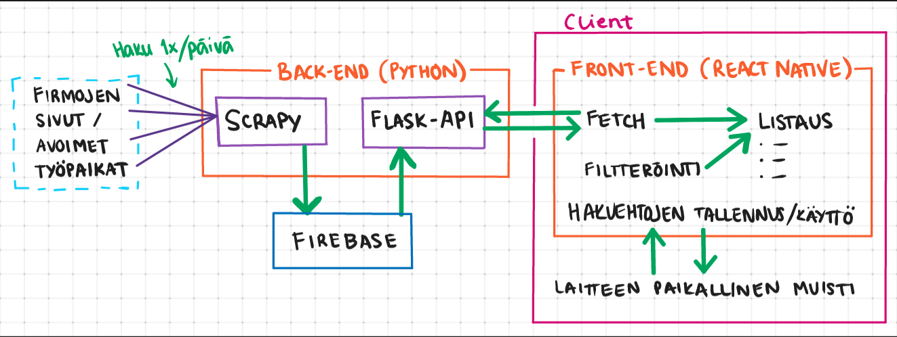
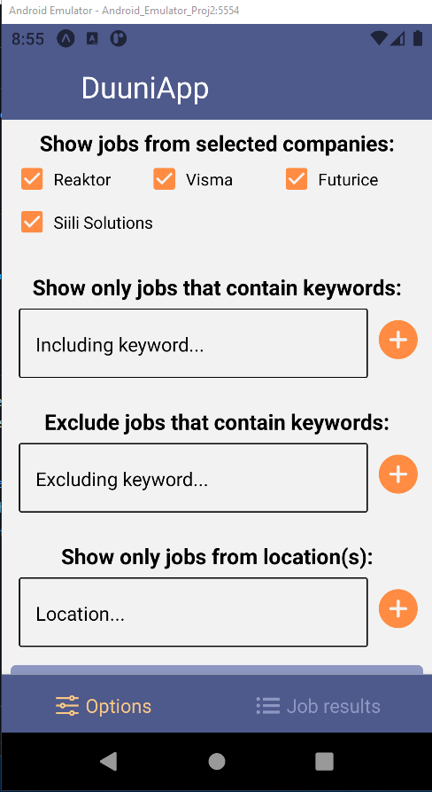
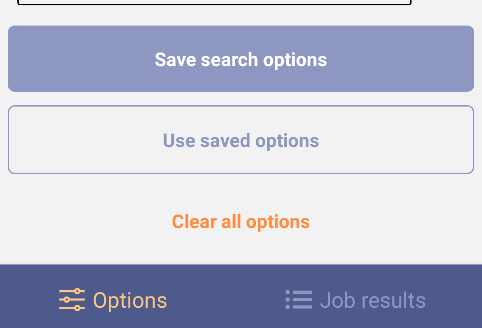
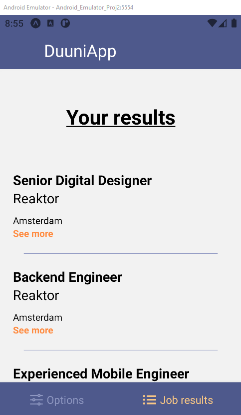

<div id="top"></div>

<!-- PROJECT LOGO -->
<br />
<div align="center">
  
<h3 align="center">TyönhakuAppi</h3>

<p align="center">
    Project created part of Ohjelmistoprojekti II - course <br />

  <p>This Readme file serves two repositories: Frontend and Backend</p>
<br />
</p>
</div>

## Project team
  <p>Juho Rissanen, Aleksi Saarinen, Tia Venäläinen, Jasmin Lumme & Elisa Tuovila</p>

<!-- ABOUT THE PROJECT -->
## About The Project

This project was designed and created for the course Ohjelmistoprojekti II. It acts as a learning experience about different web development technologies and project management. Our team wanted to study web scraping with Python, so we based our topic of the project on that.

DuuniApp utilizes Scrapy to gather data about available job positions from different web sites. This data is sent to a mobile application via Flask API. Users can browse available jobs and filter the results with conditions of their choice. Those conditions can be saved to the device for later use.

<p align="right">(<a href="#top">back to top</a>)</p>


### Built With


* [Python](https://www.python.org/)
* [Scrapy](https://scrapy.org/)
* [Flask](https://flask.palletsprojects.com/en/2.1.x/)
* [Firebase](https://firebase.google.com/)
* [React Native](https://reactnative.dev/)
* [Expo](https://expo.dev/)
* [Heroku](https://heroku.com)

<p align="right">(<a href="#top">back to top</a>)</p>





<!-- GETTING STARTED -->
## Getting Started

To get a local copy up and running follow these simple steps.

### Prerequisites

If you want to run this application on your phone you should have expo application installed on your mobile device.
You can also run this application on web or emulator.
Backend works on Heroku so you dont need to run it on your device if you dont want

### Installation

1. Clone the repos
   ```sh
   git clone https://github.com/Ohjelmistoprojekti-2/Frontend.git
   git clone https://github.com/Ohjelmistoprojekti-2/Backend.git
   ```
2. Install Frontend packages
   ```sh
   npm install
   ```
3. Install Backend packages from requiremenets.txt file
   ```sh
   pip install -r requirements.txt
   ```
4. To launch the program => In your Frontend root
   ```sh
   expo start => Follow options from terminal to launch in web / mobile / emulator
   ```


<p align="right">(<a href="#top">back to top</a>)</p>


<!-- USAGE EXAMPLES -->
## Usage

<h3>Basic usage of the application</h3>



<p>Here you can choose keywords to filter out jobpostings</p>


<p>If you are running this application in your emulator / mobile device, you can save your keywords to your device memory</p>


<p>In the Job results tab you can see all the results from your search conditios</p>

<p align="right">(<a href="#top">back to top</a>)</p>


<!-- ACKNOWLEDGMENTS -->
## Acknowledgments

Helpful recourses

* [React Native Paper](https://reactnativepaper.com/)
* [React Native Elements](https://reactnativeelements.com/)


<p align="right">(<a href="#top">back to top</a>)</p>